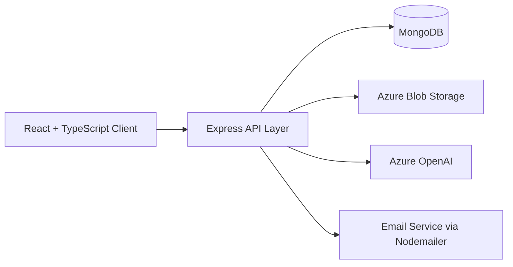

# TutorSphere
### AI-powered tutor discovery, course delivery, booking operations, and tutor revenue management platform.


---

## 1. Project Title and Tagline
**TutorSphere**  
A full-stack EdTech platform that connects students and tutors through AI-assisted learning, structured course delivery, and end-to-end booking and revenue workflows.

## 2. Project Overview
TutorSphere is a production-style web platform built for tutoring and digital learning operations.
It supports two primary roles (`student`, `tutor`) and combines:
- Tutor discovery and booking
- Course publishing and module-based video learning
- Resource sharing and downloads
- Messaging and notifications
- Revenue tracking and withdrawal requests
- AI-powered assistants for platform help, study guidance, and insights

This project is designed to demonstrate practical full-stack engineering across frontend UX, backend APIs, data modeling, AI integration, and cloud deployment.

## 3. Key Features
- Role-based access control for students and tutors
- Tutor onboarding, profile management, availability scheduling, and reviews
- Booking lifecycle with rescheduling, session states, and payment status tracking
- Course system with module-based videos, enrollments, coupon support, and progress tracking
- Certificate generation (PDF) after course completion
- Resource library with upload/download tracking and cloud-backed file storage
- In-app messaging between students and tutors
- Notification center for session, payment, and course events
- Tutor revenue dashboard, CSV report export, and withdrawal workflow
- Home-page **TutorSphere Assistant** chatbot for platform navigation help

## 4. Tech Stack
| Layer | Technologies |
| --- | --- |
| Frontend | React 19, TypeScript, Vite, Tailwind CSS v4, Motion |
| Backend | Node.js, Express, TypeScript, tsx |
| Database | MongoDB + Mongoose |
| Auth & Session | JWT, `express-session`, `connect-mongo` |
| Cloud Storage | Azure Blob Storage |
| AI | Azure OpenAI (with fallback handling in services) |
| File & Media | Multer, Busboy, Sharp |
| Email | Nodemailer (OTP/password reset flow) |
| Docs/Exports | jsPDF (certificate/receipt outputs) |

## 5. Architecture Overview
TutorSphere follows a full-stack monorepo architecture:



### Backend modules (high level)
- `auth` and session-based role checks
- `bookings`, `courses`, `resources`, `messages`, `notifications`
- `revenue-insights`, `withdrawals`, and report generation
- AI services: TutorSphere Assistant, skill-assessment chat, exam-preparation AI, trusted-resources AI, roadmap guidance

## 6. My Main Responsibilities
As the core contributor for this project, my responsibilities included:
- Designing and implementing the full-stack architecture (client + API + database)
- Building role-based authentication/session flows for student and tutor experiences
- Implementing booking, course, resource, and enrollment APIs with MongoDB models
- Developing Azure Blob media pipelines for thumbnails, videos, resources, and session files
- Implementing payment-aware flows (status, references, receipts) and certificate generation
- Building tutor earnings, withdrawal requests, and revenue reporting/insight features
- Integrating AI-powered assistants and keeping scoped/safe prompt behavior for platform support
- Deploying and configuring the app for Azure-hosted environments with environment-based security settings

## 7. AI Features
| Feature | Purpose | Endpoint/Area |
| --- | --- | --- |
| TutorSphere Assistant (Home chatbot) | Helps users navigate tutors/courses/bookings/resources/certificates | `/api/faq-chatbot/chat` |
| Skill Assessment / Quiz Chatbot | Guided quiz-style interaction for logged-in users | `/api/quiz-chatbot/chat` |
| Ask & Learn / Platform Q&A Modes | Context-aware responses for study and platform support | `faq-chatbot` modes |
| Exam Preparation AI | Generates practice sets and improvement tips | `/api/exam-preparation-ai/*` |
| Trusted Resources AI | Recommends curated learning resources by topic | `/api/trusted-resources/generate` |
| Revenue Insights AI (Tutor) | Forecast, pricing, and tax-style summaries from tutor data | `/api/revenue/insights` |

## 8. Cloud Deployment
TutorSphere is designed for Azure-first deployment:
- **Hosting:** Azure App Service style runtime (`PORT` from environment)
- **Media/File Storage:** Azure Blob Storage containers for avatars, course videos, resources, certificates, and session files
- **AI:** Azure OpenAI for assistant and analytics workflows
- **Database:** MongoDB connection via `MONGODB_URI`

### Demo
- Live Demo: `[Add deployed URL here]`
- Product Walkthrough Video: `[Add YouTube/Loom link here]`

## 9. Screenshots Section Placeholders
> Add real screenshots from your running app for recruiter impact.

| Area | Placeholder |
| --- | --- |
| Home + TutorSphere Assistant | `docs/screenshots/home-assistant.png` |
| Tutor Discovery + Profile | `docs/screenshots/tutor-profile.png` |
| Booking + Session Management | `docs/screenshots/booking-flow.png` |
| Course Learning + Video Modules | `docs/screenshots/course-learning.png` |
| Resource Library + AI Recommendations | `docs/screenshots/resources-ai.png` |
| Tutor Earnings + Withdrawals | `docs/screenshots/tutor-earnings.png` |

## 10. Setup Instructions
### Prerequisites
- Node.js `>=20`
- npm
- MongoDB database
- Azure Storage account
- Azure OpenAI credentials (for AI-enabled flows)

### Installation
```bash
git clone https://github.com/<your-username>/tutorsphere.git
cd tutorsphere
npm install
```

### Configure environment
```bash
cp .env.example .env
```
Then update required values in `.env`.

### Run in development
```bash
npm run dev
```
App runs on `http://localhost:3000` by default.

### Build and run production
```bash
npm run build
npm start
```

## 11. Environment Variables
Use `.env.example` as the source of truth. Never commit real secrets.

| Variable | Required | Description |
| --- | --- | --- |
| `MONGODB_URI` | Yes | MongoDB connection string |
| `JWT_SECRET` | Yes (prod) | JWT signing secret |
| `SESSION_SECRET` | Yes (prod) | Express session secret |
| `ALLOWED_ORIGINS` | Yes (prod) | Comma-separated CORS origins |
| `AZURE_STORAGE_CONNECTION_STRING` | Yes | Azure Blob Storage connection |
| `AZURE_BLOB_CONTAINER_PROFILE_IMAGES` | Yes | Container for profile images |
| `AZURE_BLOB_CONTAINER_COURSE_THUMBNAILS` | Yes | Container for course thumbnails |
| `AZURE_BLOB_CONTAINER_VIDEOS` | Yes | Container for course videos |
| `AZURE_BLOB_CONTAINER_RESOURCES` | Yes | Container for resource files |
| `AZURE_BLOB_CONTAINER_SESSION_RESOURCES` | Yes | Container for session resources |
| `AZURE_BLOB_CONTAINER_RECORDED_LESSONS` | Yes | Container for recorded lesson files |
| `AZURE_BLOB_CONTAINER_TUTOR_CERTIFICATES` | Yes | Container for tutor certificates |
| `AZURE_OPENAI_ENDPOINT` | Yes (AI) | Azure OpenAI endpoint |
| `AZURE_OPENAI_API_KEY` | Yes (AI) | Azure OpenAI API key |
| `AZURE_OPENAI_DEPLOYMENT` | Yes (AI) | Azure OpenAI deployment name |
| `AZURE_OPENAI_API_VERSION` | Yes (AI) | Azure OpenAI API version |
| `GMAIL_USER` / `GMAIL_APP_PASSWORD` / `EMAIL_FROM` | Optional/Feature-based | OTP and password-reset email flow |

## 12. Future Improvements
- Add automated test suites (unit/integration/e2e)
- Introduce CI/CD workflows with deployment gates
- Integrate a full payment gateway for live transaction processing
- Improve observability (structured logs, metrics, tracing)


## 13. Contact / Author
**Author:** `Kavindu Umayanga`  
**LinkedIn:** [kavindu-umayanga](https://www.linkedin.com/in/kavindu-umayanga/)  
**GitHub:** [kavinduumayanga](https://github.com/kavinduumayanga)  
**Email:** kavinumayanga@gmail.com

---

If you are a collaborator interested in this project, feel free to connect.
